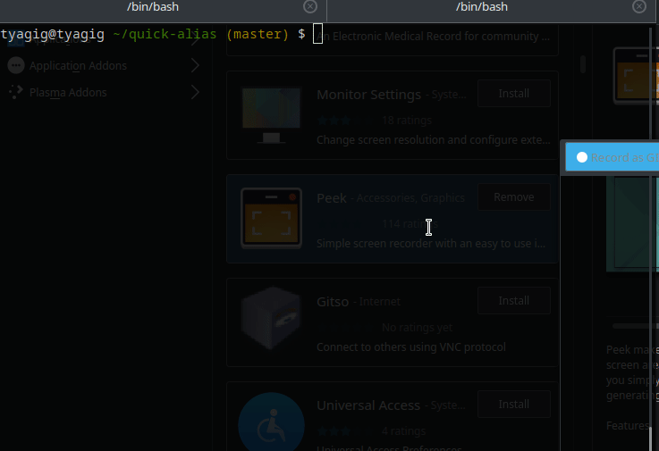

### qa(quick-alias)
  
A CLI tool for creating aliases for long and repeated command(s).<br> 

All of the alias mappings will be store in toml file on the user machine.<br>

Users can add/remove these aliasing.<br>

#### GIF Example



#### Example:<br> 
###### Add
```
qa -a "bb" "bazel build"
qa -a "db_path" "my/db/path/here/"
qa -a "merge_path" "merge/path/here/"
```
###### Call
```
qa {bb} {db_path}/new/{merge_path}  == Will resolve to=> bazel build my/db/path/here/new/my/merge/path/here/
``` 
###### Remove
```
qa -r "bb"
```
